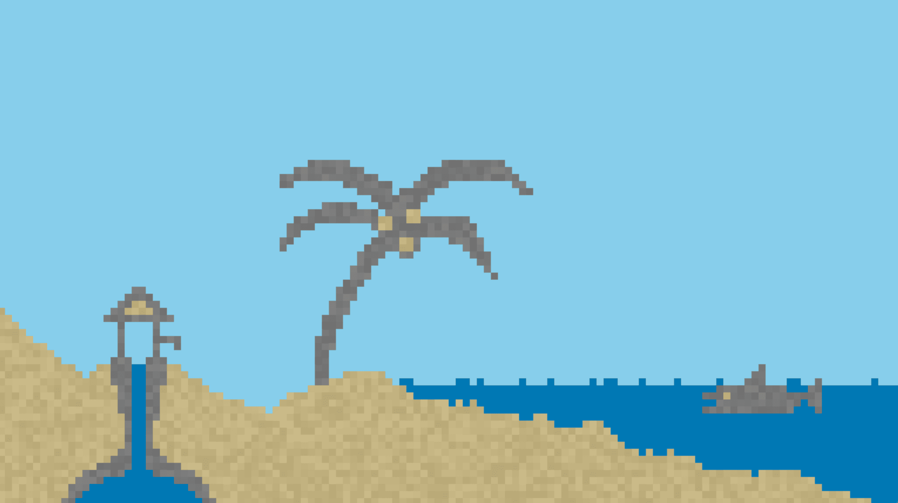
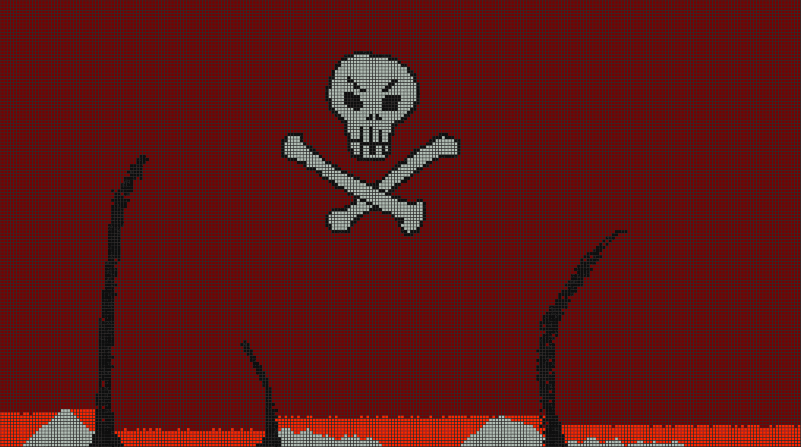

# Pixel Sandbox

A highly-customisable pixel sandbox simulator using PyGame.

## How to Use

You can run `main.py` which will open a PyGame window. You can draw particles onto this screen and they will automatically update and start moving.

You can select particles by clicking numbered keys:
* 0 = Empty
* 1 = Sand
* 2 = Rock
* 3 = Water

## Current Particles

### Sand (id=1)
* Falls down.
* If directly down is blocked, it'll go down-left diagonal or down-right diagonal.
### Rock (id=2)
* Stays put but blocks other particles from falling.
### Water (id=3)
* Falls down.
* If directly down is blocked, it'll go down-left diagonal or down-right diagonal.
* If diagonally down is blocked, it'll go left or right.

## Customising your View

In `config.json` you have the following options:

* `background_colour` changes the colour of the background (but not empty cells - see `cell_padding`)
* `particle_colour` changes the base colour of particles (index is particle's id).
* `randomise_particle_colour` will slightly adjust the colour of particles, if true, for that given particle (index is particle's id).
* `screen_title` changes the heading of the PyGame window.
* `grid_size` changes the dimensions of the cell grid (width, height).
* `cell_size` changes the size of cells by pixels.
* `cell_padding` changes the spacing between cells by pixels.
* `screen_border` changes the distance the grid is drawn from the edge of the window.

*Note: the window size will adjust automatically based on * `grid_size`, `cell_size`, `cell_padding` and `screen_border`.*

## Adding Custom Particles
You can add your own particles by:
* opening `config.json`:
    * adding a new base colour to `particle_colours`.
    * adding a new randomise colour choice to `randomise_particle_colour`.
* creating your own Python script:
    * write your particle logic in a function.
* opening `particle.py`:
    * adding new variables based on the commented template.
* opening `main.py`:
    * under `if event.type == pygame.KEYDOWN :` add a new keybind to draw your particle.

With help from video tutorial by 'Programming With Nick': https://www.youtube.com/watch?v=JKv6CwOiIlU